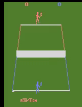
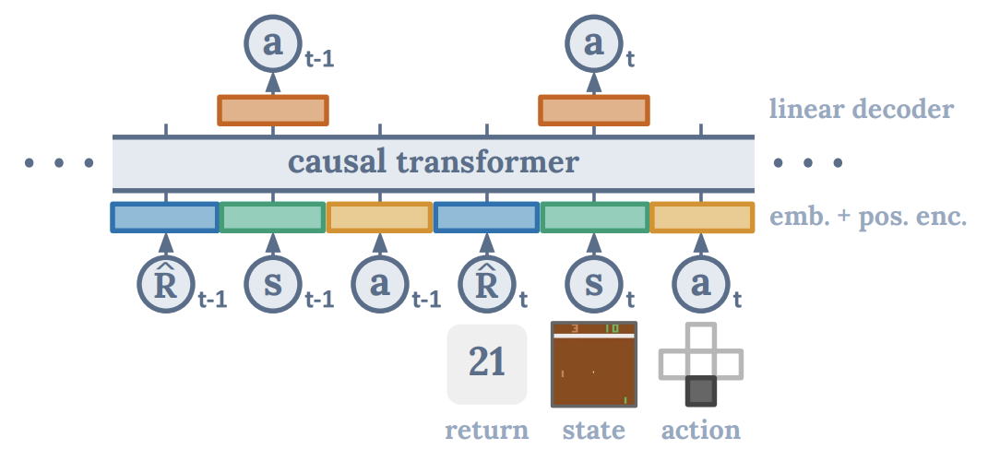
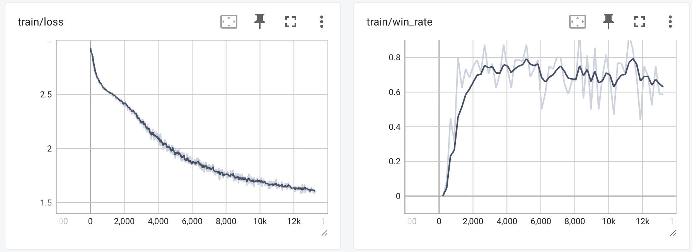

# DecisionTransformerForTennis
Course project of SDSC6007 Reinforcement Learning. 

Using Decision transformer to play tennis in atari environment `tennis`.

Atari bot is just a piece of cake for our best Decision Transformer player for tennis! 

## Tennis Environment
You control the orange player playing against a computer-controlled blue player. The game follows the rules of tennis. The first player to win at least 6 games with a margin of at least two games wins the match. If the score is tied at 6-6, the first player to go 2 games up wins the match.
| Space             | Value |
| ------------------| --------------------------------- | 
| Action Space      | Discrete(18)                      |
| Observation Space | Box(0, 255, (210, 160, 3), uint8) |

## Model Architecture

### Visual encoder
To address the key local features in the Atari Tennis environment (two players and a relatively small ball), I abandoned the original simple cnn image encoder used by the Decision Transformer. Instead, I modified the encoder based on the CleanRL PPO Impala encoder: during the convolution stage, I adopted shorter strides and removed some of the pooling layers to ensure the encoder retains sufficient local features. 

ResidualConvBlock is used as general structure:

Overall encoder architecture is shown below:

### DecisionTransformer

DT part is almost the same as [the paper](https://arxiv.org/pdf/2106.01345), however, due to the complexity of atari tennis environment(not only 18 action dimensions which the number is 4 in the paper, but also the difficulty the tennis game itself), we add the Hyperparameter of `layers`, `embedding dimension` and `attention head` accordingly.
| Hyperparameter            | DT paper settings | Ours for tennis env |
| ------------------------- | ----------------- | ------------------- |
| Number of layers          | 3                 | 12                  |
| number of attention heads | 1                 | 16                  |
| embedding dimension       | 128               | 512                 |

## Dataset Collection

### Offline Expert Dataset

This dataset is collected for the first step of supervised training.

Dataset was collected following the instructions of the minari dataset [`atari/tennis/expert-v0`](https://minari.farama.org/datasets/atari/tennis/expert-v0/), expert action is generated by CleanRL PPO Impala provided by [CleanRL’s HuggingFace repository](https://huggingface.co/cleanrl/Tennis-v5-cleanba_ppo_envpool_impala_atari_wrapper-seed1).

This Dataset contains 1k episodes and over 6m steps.

### Self-Supervised Dataset

This dataset is collected during the 2nd training period and used for training after each round of the self-supervised training.

Each Dataset contained 80% of data collected from single agent env and other 20% of data from multi agent env, actions is generated by the training model.

## Traning Strategy
Inspired by the training strategy of AlphaGowhich was first trained on a large dataset of expert human Go games. It used these records to learn how to predict the moves that professional players would make. This phase taught the neural network a strong foundation for reasonable play.

After the initial supervised learning, AlphaGo improved further by playing millions of games against itself. Through self-play, AlphaGo used reinforcement learning to discover new strategies and refine its policy and value networks beyond human knowledge. 

According to the strategy above, we divide the training into two periods: 
- the first period is Supervised Learning based on fixed offline dataset
- the second period is Self-Play Optimization

### First period: Supervised Learning
uses the PPO model to generate actions and collect an offline dataset from the environment, which is introduced above as `Offline Expert Dataset`.

Training metric is shown below:

### Second period: Self-Play Optimization

TODO